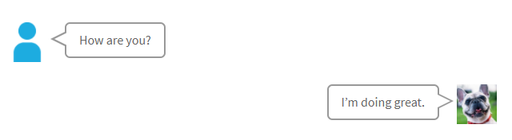

# Speech Bubble Plugin

The **Speech Bubble** Plugin is for [Grav CMS](http://github.com/getgrav/grav). Easily display a dialogue style speech bubble.

## Installation

Installing the Speech Bubble plugin can be done in one of two ways. The GPM (Grav Package Manager) installation method enables you to quickly and easily install the plugin with a simple terminal command, while the manual method enables you to do so via a zip file.

### GPM Installation (Preferred)

The simplest way to install this plugin is via the [Grav Package Manager (GPM)](http://learn.getgrav.org/advanced/grav-gpm) through your system's terminal (also called the command line).  From the root of your Grav install type:

    bin/gpm install speech-bubble

This will install the Speech Bubble plugin into your `/user/plugins` directory within Grav. Its files can be found under `/your/site/grav/user/plugins/speech-bubble`.

### Manual Installation

To install this plugin, just download the zip version of this repository and unzip it under `/your/site/grav/user/plugins`. Then, rename the folder to `speech-bubble`. You can find these files on [GitHub](https://github.com/kinformation/grav-plugin-speech-bubble) or via [GetGrav.org](http://getgrav.org/downloads/plugins#extras).

You should now have all the plugin files under

    /your/site/grav/user/plugins/speech-bubble

> NOTE: This plugin is a modular component for Grav which requires [Grav](http://github.com/getgrav/grav) and the [Error](https://github.com/getgrav/grav-plugin-error) and [Problems](https://github.com/getgrav/grav-plugin-problems) to operate.

## Configuration

Before configuring this plugin, you should copy the `user/plugins/speech-bubble/speech-bubble.yaml` to `user/config/plugins/speech-bubble.yaml` and only edit that copy.

Here is the default configuration and an explanation of available options:

```yaml
enabled: true
bubble:
  type: std
icon:
  type: square
  image:
    left: /path/to/foo.jpeg
    right: /path/to/bar.jpeg
```

* `bubble.type`: Set bubble type.`std`, `pop`, `think` or `flat`.
* `icon.type`: Set icon frame type.`square`, `circle` or `hidden`.
* `icon.image`: Set icon path.

## Usage

```
[bubble side=left type=std]How are you?[/bubble]
[bubble side=right icon=/path/to/bar.jpeg]I’m doing great.[/bubble]
```


* options
    * `side`: Set bubble side `right` or `left`. If option is not set, `left`.
    * `type`: Set bubble type.`std`, `pop`, `think` or `flat`. If option is not set, use the value of config.
    * `icon`: Set icon path. If option is not set, use the value of config.
    * `label`: Set icon label. It is not displayed when `icon.type` is `hidden`.
